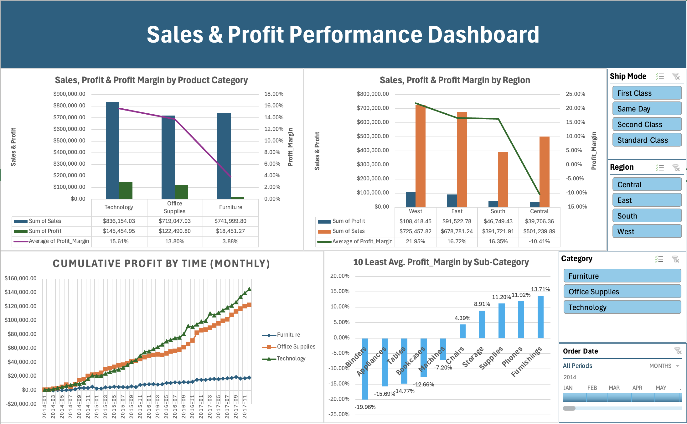

## Project Overview
This project presents an interactive **Sales & Profit Performance Dashboard** built entirely in Microsoft Excel.  
The objective is to analyze sales performance, profitability, and profit margin patterns across **product categories, regions, and time**, and to identify key risk areas and growth drivers.

The dashboard is designed to simulate a real-world business reporting scenario and supports dynamic exploration through slicers and a timeline.

---

## Business Questions
The analysis aims to answer the following questions:

- Which product categories generate the highest sales and profit?
- How does profitability vary across regions?
- Are there sub-categories with strong sales but weak profit margins?
- How does profit accumulate over time by category?
- Which segments or shipping modes may contribute to profit erosion?

---

## Dataset
- **Source:** Superstore Sales Dataset  
- **Granularity:** Order-level transactional data  
- **Time Period:** 2014 – 2017  
- **Records:** ~10,000 orders  

---

## Data Cleaning & Preparation
All data preparation was performed in Excel, including:

- Converted date fields to proper Date format for time-based analysis
- Standardized numerical fields (Sales, Profit, Quantity, Discount)
- Created calculated field:
  - **Profit Margin = Profit / Sales**
- Organized data into structured Excel Tables for reliable PivotTable analysis

---

## Analysis & Dashboard Features

### Key Metrics
- Total Sales
- Total Profit
- Average Profit Margin

### Visual Analysis
- **Sales, Profit & Profit Margin by Product Category**
- **Sales, Profit & Profit Margin by Region**
- **Cumulative Profit Over Time (Monthly) by Category**
- **Top 10 Lowest Average Profit Margin Sub-Categories**

### Interactivity
The dashboard includes interactive controls:
- Category slicer
- Region slicer
- Ship Mode slicer
- Order Date timeline (monthly)

All visuals update dynamically based on user selections.

---

## Key Insights
- **Technology** consistently drives long-term profitability and shows the strongest cumulative profit growth.
- **Furniture** generates high sales volume but exhibits significantly lower profit margins, indicating structural profitability issues.
- The **Central region** shows negative average profit margins, highlighting regional operational risk.
- Several sub-categories display **positive total profit but negative average profit margins**, suggesting that a small number of large loss-making orders offset otherwise profitable transactions.
- Cumulative profit analysis provides a clearer view of long-term performance compared to monthly profit volatility.

---

## Limitations
- The dataset does not include cost breakdowns (e.g., shipping or procurement costs).
- Profit margin is calculated at the order level and averaged, which may differ from weighted margin calculations used in financial reporting.
- External factors such as promotions or seasonal effects are not explicitly modeled.

---

## Tools Used
- Microsoft Excel  
  - PivotTables  
  - PivotCharts  
  - Slicers & Timeline  
  - Calculated Fields  

---

## Dashboard Preview

---

## Author
Power  
Aspiring Data Analyst | Excel, SQL, Power BI, Python
